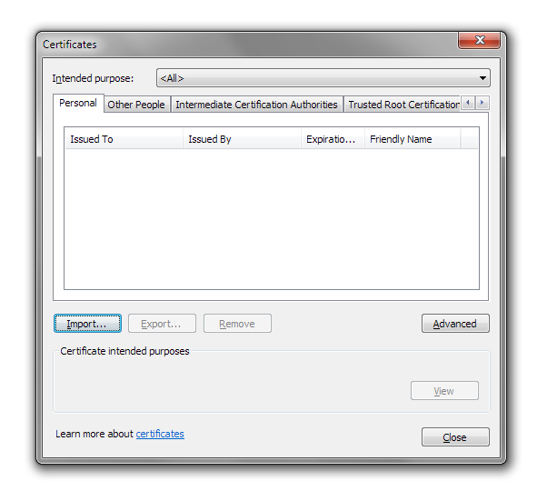
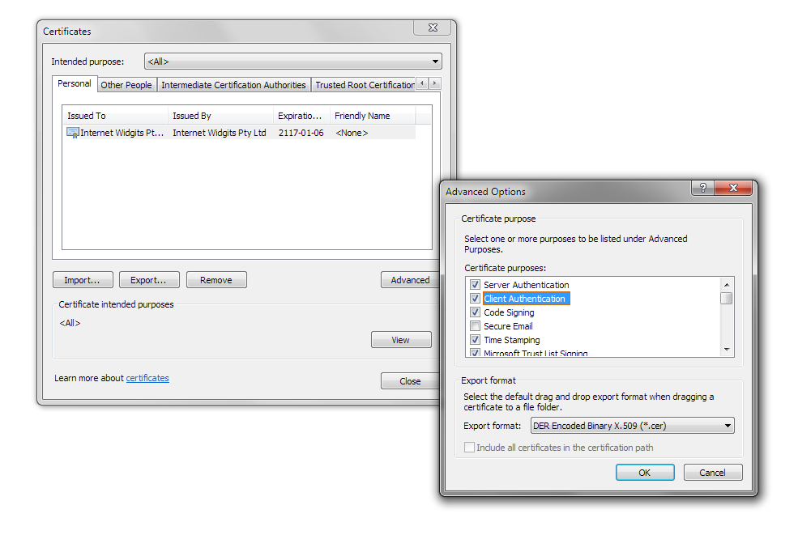
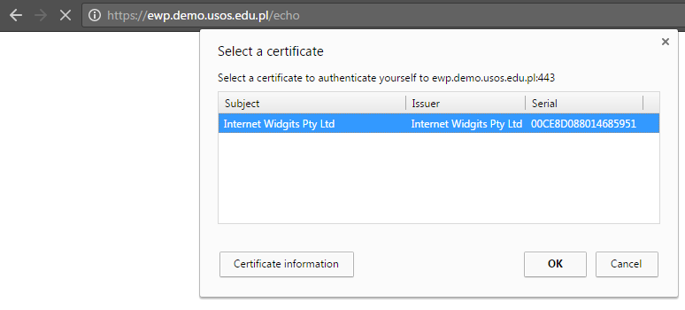
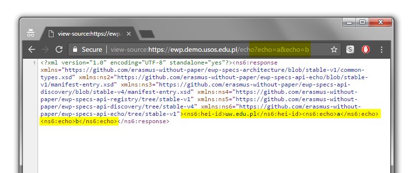

Echo API
========

* [What is the status of this document?][statuses]
* [See the index of all other EWP Specifications][develhub]


Summary
-------

**EWP Echo API** makes it simpler for EWP developers to design and test the
core of their EWP implementations. It is RECOMMENDED for all developers to
implement it (and keep it updated) **at least in their development EWP Hosts**,
to avoid potential problems in the future.

The requirements listed below might seem trivial, but they require the
developer to implement the core security framework which will be needed
throughout the development of **all the other** EWP features.


Requirements
------------

In order to properly implement the Echo API, you will need to:


### Step 1. Verify the SSL Certificate

This step is designed to make sure that you **follow EWP security policies**.

 * You MUST ask the client for its certificate and verify if the request is
   coming from within the EWP Network. The certificate's SHA-256 fingerprint MUST
   match at least one of the fingerprints published in the [Registry Service]
   [registry-spec]. Note, that [clients certificates MAY be self-signed]
   (https://github.com/erasmus-without-paper/ewp-specs-architecture/issues/3)
   (you MUST allow such certificates).

 * If the verification has **failed**, respond with a **HTTP 403** status. You
   SHOULD return some descriptive error message too (wrapped in XML), as
   described in the [general error handling rules][error-handling].

 * If the verification has **succeeded**, proceed to the next step.


### Step 2. Verify request method and content type

 * You SHOULD allow both GET and POST request methods. If other request
   types are received (e.g. PUT), respond with **HTTP 405** error status, as
   described in the [general error handling rules][error-handling]

 * If POST is received, then you MUST be able to decode at least the
   `application/x-www-form-urlencoded` content type. It is not required to
   support any other encodings (such as `multipart/form-data`), and you MAY
   respond with a **HTTP 415** error status upon receiving such unsupported
   encodings.


### Step 3. Retrieve the `echo` parameter (optional, repeatable)

 * Retrieve `echo` values (plural) from request. The `echo` parameter is
   *repeatable*. It means that it can appear **more than once** (e.g.
   `url?echo=...&echo=...`). Such repeatable parameters will be used throughout
   other EWP APIs, so you should be able to retrieve them properly.

 * *Optional* means, that the list of `echo` values is allowed to be of
   zero-length. It is valid to call the echo URL with no `echo` parameters.

 * You will include the list of all retrieved `echo` values in your response
   below.


### Step 4. Identify the covered HEIs

This step is designed to make sure you can **identify the HEIs covered by the
requester**. Note, that there can be any number of them (`0..*`, see discussion
[here](https://github.com/erasmus-without-paper/ewp-specs-api-echo/issues/3)).

 * In the first step above, you have already found the *list* (!) of
   `<host>` elements bound to the client certificate used in this request. Now,
   you will need to build on that information, and retrieve *the list of HEIs
   these hosts cover*. Consult [Registry API specification][registry-spec] for
   useful hints (i.e. examples of XPath expressions).

 * You will include this list of HEI IDs in your response below.


### Step 5. Construct the response

 * Respond with a **HTTP 200** status, and a document described by the
   [response.xsd](response.xsd) schema.

 * The document MUST contain the values retrieved in the previous steps. See
   the schema file for details.


Deployment
----------

The last requirement is to publish the URL of your Echo API implementation in
your Manifest file, so that other developers (and, possibly, continuous
integration scripts) may discover and test it.

The format of the Echo API manifest entry is described in the
[manifest-entry.xsd](manifest-entry.xsd) file. You will need to use a proper
`xmlns` when you are including it in your manifest file.


Debugging
---------

These sample steps will show you how a self-signed client certificate can be
installed in your browser for easy debugging.

1. **Generate a key-pair and a corresponding certificate.** The key-pair will
   initially be encrypted with the password you provide:

   ```bash
   openssl req -x509 -newkey rsa:2048 -keyout browser.key.pem -out browser.crt.pem -days 36500
   ```

2. **Decrypt your key-pair file**. This step in not strictly required, but it
   makes your work easier (you won't need to supply a password every time
   you'll want to use the key).

   ```bash
   openssl rsa -in browser.key.pem -out browser.key.pem
   ```

3. **Paste your new public certificate into your manifest file.** Use the
   base64-encoded part from `browser.crt.pem` file. It should look like [this]
   (https://github.com/erasmus-without-paper/ewp-specs-api-discovery/blob/v4.0.1/manifest-example.xml#L66).

   Note, that it doesn't have to be the same manifest file you publish your
   Echo API with. It needs to be registered in the EWP Registry though. The
   point of publishing it, is to inform the EWP Network (including **your own**
   Echo API) that you will be using it.

4. **Convert to PFX format.** This step might be unnecessary, if your system
   and/or browser allows you to import certificates in other formats. Note,
   that you don't need to supply the export password (you can leave it empty).

   ```bash
   openssl pkcs12 -inkey browser.key.pem -in browser.crt.pem -export -out browser.pfx
   ```

5. **Import the PFX certificate into your browser.** For example, in Chrome it
   looks like this:

   * Go to settings and type "cert" in search box. You should see "Manage
     certificates..." button.

   * In *Personal* tab, click "Import...".

     

   * Continue to import the certificate from your `browser.pfx` file.

   * Once you're done, make sure that the certificate is marked to be used for
     Client Authentication.

     

6. **Test it.** If you have installed your certificate successfully **AND** if
   your Echo API properly requests the client to provide a certificate, then
   you should see the following when you visit your Echo API URL in your
   browser:

   

   Your browser should ask you which client certificate you want to use for
   this session. Note, that this decision is cached by the browser for a
   duration of the session. So, if you want to test your Echo API with multiple
   client certificates, then you will probably want to do this in an *Incognito
   Window*.

   If your Echo API works correctly **AND** the information about your client
   certificate has already propagated through the network (see step 3), then
   you should see a valid Echo API response. Note, that `<hei-id>` values
   depend on the values of [`<institutions-covered>`]
   (https://github.com/erasmus-without-paper/ewp-specs-api-discovery/blob/v4.0.1/manifest-example.xml#L58)
   in your manifest file.

   


[registry-spec]: https://github.com/erasmus-without-paper/ewp-specs-api-registry
[discovery-api]: https://github.com/erasmus-without-paper/ewp-specs-api-discovery
[develhub]: http://developers.erasmuswithoutpaper.eu/
[statuses]: https://github.com/erasmus-without-paper/ewp-specs-management#statuses
[error-handling]: https://github.com/erasmus-without-paper/ewp-specs-architecture#error-handling
